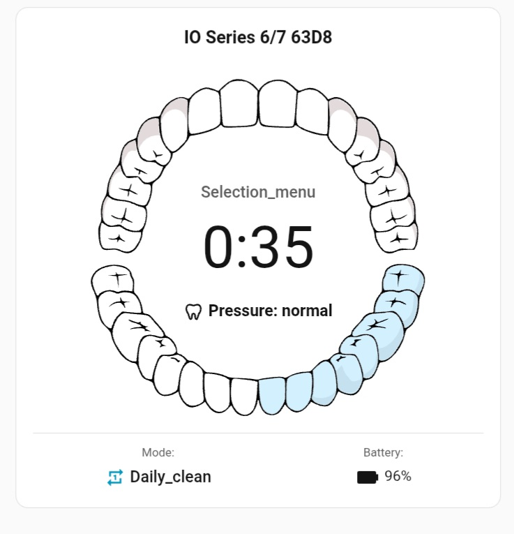

# 🪥 Toothbrush Card

[](https://github.com/hacs/integration)
[](https://github.com/mtheli/toothbrush-card/releases)
[](LICENSE)

A **Custom Lovelace Card** for [Home Assistant](https://www.home-assistant.io/) designed to visualize **Oral-B toothbrushes** integrated via the official `oralb` integration.  
The card displays real-time status, battery, brushing sectors, mode, and other relevant information directly on your dashboard.

---

## 📸 Screenshot / Preview

Hier ist ein Beispiel, wie die Karte im "Brushing"-Zustand aussieht.



### Visual States

The SVG display reacts to the `sector` sensor:

* **Idle / Ready:** Default view, all sectors are neutral.
* **Brushing (Sector 1-4):** The active sector (e.g., Upper Right) is highlighted.
* **Success:** All sectors are marked as "cleaned" when the toothbrush sends the "success" status.

---

## 🚀 Features

- Automatic detection of all relevant entities for an Oral-B device:  
  - `sector` – currently brushed quadrant  
  - `duration` – brushing session duration  
  - `pressure` – brushing pressure  
  - `mode` – brushing mode (e.g., Daily Clean, Sensitive)  
  - `battery` – battery level  
  - `status` – overall device status
- Visual representation of brushing sectors via an SVG display
- Live updates every second
- Easy configuration via UI device selector — no manual YAML required
- Fully compatible with HACS (Home Assistant Community Store)

---

## ⚙️ Installation

### Method 1 – Via HACS (Recommended)
1. Open **HACS → Frontend → Custom Repositories**
2. Add the repository: `https://github.com/mtheli/toothbrush-card`
3. Install **Toothbrush Card**
4. Refresh your Home Assistant dashboard

### Method 2 – Manual
1. Download the file [`src/toothbrush-card.js`](https://raw.githubusercontent.com/mtheli/toothbrush-card/main/src/toothbrush-card.js)  
2. Copy it to your Home Assistant folder: `/config/www/community/toothbrush-card/`
3. Add resource in Lovelace:
```yaml
resources:
  - url: /local/community/toothbrush-card/toothbrush-card.js
    type: module
```

## 🧩 Usage & Configuration

### UI-Based Configuration
When adding the card via the dashboard, a configuration form is displayed:
```js
static getConfigForm() {
  return {
    schema: [
      {
        name: "device_id",
        required: true,
        selector: {
          device: {
            filter: {
              integration: "oralb"
            },
            multiple: false
          }
        }
      }
    ]
  };
}
```

- `device_id` (required): Select the Oral-B device registered via the `oralb` integration.
- The card automatically maps entities like sector, duration, pressure, battery, mode, and status.

### Optional YAML Configuration
```yaml
type: custom:toothbrush-card
device_id: 1234567890abcdef
```

## 📊 Supported Data Points

| Attribute | Description |
|-----------|-------------|
| sector    | Current brushed quadrant, or `success` when done |
| duration  | Brushing session duration (seconds) |
| mode      | Brushing mode (e.g., Daily Clean, Sensitive) |
| pressure  | Current brushing pressure |
| battery   | Battery level (%) |
| status    | Overall device status (ready, charging, etc.) |

## 💡 Tips

- One card supports a single toothbrush; add multiple cards for multiple devices.
- UI configuration ensures correct device selection.

## 🧑‍💻 Development

1. Clone repository:
```bash
git clone https://github.com/mtheli/toothbrush-card.git
```
2. Edit `src/toothbrush-card.js`
3. Test in Home Assistant environment
4. Pull requests welcome

## 📄 License

MIT License – see `LICENSE` file

> "Brushing made visible — smart, interactive, and stylish."
