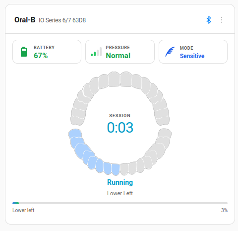

# Toothbrush Card

[](https://github.com/hacs/integration)
[](https://github.com/mtheli/toothbrush-card/releases)
[](LICENSE)

A **Custom Lovelace Card** for [Home Assistant](https://www.home-assistant.io/) designed to visualize **Oral-B toothbrushes** integrated via the official `oralb` integration.



---

## Features

- Real-time brushing visualization with animated tooth SVG (4 or 6 sectors)
- Chip-based display for battery, pressure, and brushing mode
- Bluetooth connection status indicator (Pantone 285 blue)
- Progress bar based on 2-minute brushing target
- Success badge when all sectors are complete
- Automatic entity discovery — no manual YAML required
- Configurable title, subtitle, and accent color (10 official Oral-B presets)
- Configurable sector order with drag & drop and up/down buttons
- Responsive layout with container queries (icon-only chips on narrow cards)
- Light and dark mode support via HA CSS variables

## Supported Data Points

| Sensor   | Description                                      |
|----------|--------------------------------------------------|
| Status   | Device state (idle, running, charging, …)        |
| Sector   | Current brushed sector (1–6) or success          |
| Duration | Brushing session duration (seconds)              |
| Pressure | Brushing pressure (low, normal, high)            |
| Mode     | Brushing mode (Daily Clean, Sensitive, Turbo, …) |
| Battery  | Battery level (%)                                |

## Installation

### HACS (Recommended)
1. Open **HACS → Frontend → Custom Repositories**
2. Add the repository: `https://github.com/mtheli/toothbrush-card`
3. Install **Toothbrush Card**
4. Refresh your Home Assistant dashboard

### Manual
1. Download `dist/toothbrush-card.js` from the [latest release](https://github.com/mtheli/toothbrush-card/releases)
2. Copy it to `/config/www/community/toothbrush-card/`
3. Add as a Lovelace resource:
```yaml
resources:
  - url: /local/community/toothbrush-card/toothbrush-card.js
    type: module
```

## Configuration

The card is configured via the UI — just add it and select your Oral-B device.

| Option        | Type     | Default | Description                                  |
|---------------|----------|---------|----------------------------------------------|
| device_id     | string   | —       | **(required)** Oral-B device to use          |
| title         | string   | —       | Custom title (default: manufacturer)         |
| show_subtitle | boolean  | true    | Show device name as subtitle                 |
| accent_color  | string   | —       | Header accent color (hex, e.g. `#0085FF`)    |
| sector_order  | string[] | —       | Custom sector order (e.g. for 6-sector mode) |

### YAML Example
```yaml
type: custom:toothbrush-card
device_id: 1234567890abcdef
title: My Toothbrush
show_subtitle: true
accent_color: "#0085FF"
```

## Known Issues

- **6-sector brushes (IO Series):** The [oralb_ble integration](https://github.com/Bluetooth-Devices/oralb-ble) only maps sectors 1–4. When a 6-sector brush reaches sectors 5 or 6, the integration incorrectly reports them as sector 4. The card includes a client-side workaround that tracks brushing progress and auto-advances past duplicate sectors, but the root cause needs to be fixed upstream in the oralb_ble parser.

## Development

```bash
git clone https://github.com/mtheli/toothbrush-card.git
cd toothbrush-card
npm install
npm run build
```

## License

MIT License — see [LICENSE](LICENSE)
