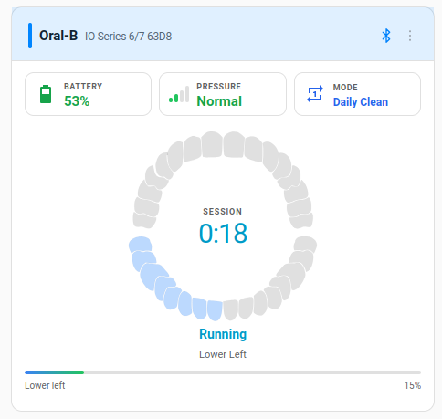
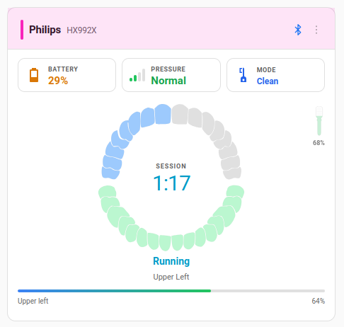
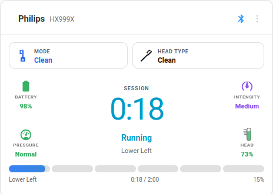

# Toothbrush Card

[](https://github.com/hacs/default)
[](https://github.com/mtheli/toothbrush-card/releases)
[](LICENSE)

A **Custom Lovelace Card** for [Home Assistant](https://www.home-assistant.io/) designed to visualize **electric toothbrushes** via Bluetooth LE integrations.

### Toothbrush Integrations

| Brand | Integration | Status |
| :--- | :--- | :---: |
| Oral-B | [`oralb`](https://www.home-assistant.io/integrations/oralb/) (built into HA Core) | ✅ |
| Oral-B | [`oralb_live`](https://github.com/thomasgregg/oralb-ha) (custom component) | ✅ |
| Philips Sonicare | [`philips_sonicare_ble`](https://github.com/mtheli/philips_sonicare_ble) (custom component) | ✅ |
| Xiaomi | [`xiaomi_ble`](https://www.home-assistant.io/integrations/xiaomi_ble/) (built into HA Core) | ✅ |
| Laifen | [`laifen_ble`](https://github.com/UrbanTechIO/Laifen) (custom component) | ✅ |
| Oclean | [`oclean_ble`](https://github.com/deniskie/ha-oclean-integration) (custom component) | ⏸️ |
| Playbrush | — | ⏸️ |

✅ supported · ⏸️ not yet sensible

The readings the card can show depend on what each integration provides:

| Reading | Oral-B ⁵ | Sonicare | Xiaomi | Laifen |
|---|:-:|:-:|:-:|:-:|
| Live timer | ✓ | ✓ | ○ ¹ | ✓ |
| Sectors | device-reported | integration-derived ⁴ | time-based ¹ | time-based ² |
| Battery | ✓ | ✓ | ✓ | ✓ |
| Pressure | ✓ | ✓ | — | ✓ ³ |
| Intensity | — | ✓ | — | — |
| Mode | ✓ | ✓ + select | — | ✓ + select |
| Score | — | — | ✓ | — |
| Brush head | — | wear · type · sessions | wear | — |
| Connection | ✓ | ✓ + ESP bridge | ✓ | ✓ |

¹ the Xiaomi broadcast has no live timer/sectors — the card synthesizes a session timer with time-based quadrants\
² aligned with the handle's 30s pacer when enabled\
³ pressure warning, Wave Pro only (needs laifen_ble 3.0.2+)\
⁴ anatomical sectors provided by the integration's sector sensor, including revisit modes (e.g. White+); the card falls back to its own time-based calculation if the sensor is absent\
⁵ applies to both `oralb` and `oralb_live` — the latter mirrors the built-in integration's entities, so the card reads it identically. Its extra sensors (smiley, battery time remaining, refill/brush-head counters) are not shown yet, see [#20](https://github.com/mtheli/toothbrush-card/issues/20)

**Tested devices**

- **Oral-B:** iO Series 6, iO 7/8/9 (Type 3758), iO 10, Pro Series D601
- **Sonicare:** DiamondClean 9000 (HX992x), Prestige 9900 (HX999x), 7400 series (HX742x), HX960x, HX993x, Sonicare for Kids
- **Xiaomi:** T700 · T500 uses the same integration and is expected to work — test reports welcome!
- **Laifen:** Wave / Wave Pro

#### Not yet sensible

- **Oclean** (`oclean_ble`) — rich per-zone statistics, but only after a session ends; no live brushing state the card could animate. Will revisit if a live status entity becomes available.
- **Playbrush** — no Home Assistant integration available yet.

Want support for another brush? [Open an issue](https://github.com/mtheli/toothbrush-card/issues) — an integration with a live brushing state is the main requirement.

## Screenshots

 

The compact view (`tooth_style: none`) — shown here with the header and chips still enabled:



Wondering what a specific icon or colour means? The [icon & colour reference](docs/ICONS.md) shows every state icon the card can display, with its trigger condition and colour.

## Supported Languages

| Language | Code | Comment |
|----------|------|---------|
| English     | en | |
| Dansk       | da | |
| Deutsch     | de | |
| Nederlands  | nl | |
| Русский     | ru | |
| Slovenščina | sl | |

The card automatically detects the language configured in your Home Assistant instance (per-user profile setting). A specific language can also be forced per card with the `language` YAML option. If your language is not yet supported, it falls back to English. Contributions for additional languages are welcome — just add a new JSON file in `src/locales/`.

---

## Features

- Real-time brushing visualization with animated tooth SVG (4 or 6 sectors)
- Chip-based display for battery, pressure/intensity, brushing mode, score and brush head
- Configurable layout: place every reading as a chip or a corner marker — or hide it
- Compact panel mode: hideable header and tooth ring with a large standalone timer (two cards fit side by side on a 480×480 wall panel)
- Bluetooth connection status indicator (Pantone 285 blue)
- Sector-segmented progress bar based on the brushing target (uses the device routine length when available)
- Session recap banner: green when the routine was completed, amber with partial progress when brushing stopped early — rebuilt from recorder history, so it shows on any browser or device
- Automatic entity discovery — no manual YAML required
- Sector tracking: device-reported (Oral-B), integration-derived (Sonicare) or time-based calculation (Xiaomi, Laifen)
- Configurable title, subtitle, and accent color
- Configurable tooth, active-sector, and completed-sector colors
- Configurable sector order with drag & drop and up/down buttons
- Responsive layout with container queries (icon-only chips on narrow cards)
- State-driven icons: battery, pressure, score and brush head step their icon shape and colour with the value, so they stay readable even icon-only — see the [icon & colour reference](docs/ICONS.md)
- Multi-language support (auto-detects Home Assistant language)
- Light and dark mode support via HA CSS variables

## Community

### Videos

[](https://www.youtube.com/watch?v=ROI91x2Swv8)

[Smartes Badezimmer? So hilft dir ein Shelly Wall Display beim Zähneputzen & Rasieren!](https://www.youtube.com/watch?v=ROI91x2Swv8) — Video by [@smartmatic](https://github.com/smartmatic) showing the card on a Shelly Wall Display alongside the Philips Shaver integration (German)

### Blueprints

[Toothbrushing Notification System (Morning/Evening)](https://community.home-assistant.io/t/adhd-friendly-toothbrushing-notification-system-morning-evening/1017326) — a blueprint by [@CoatsyJnr](https://github.com/CoatsyJnr) that reminds you to brush morning and evening, at deliberately unpredictable times so the reminder does not fade into background noise. It triggers on the same live brushing state this card visualizes, so the two go well together: the blueprint reminds, the card shows what is going on. On the Sonicare side, point it at the **Brushing** binary sensor — the other sensors its description suggests never fire, see [CoatsyJnr/home-assistant-blueprints#1](https://github.com/CoatsyJnr/home-assistant-blueprints/issues/1).

## Installation

### HACS (Recommended)

This card is available in the **default HACS store** — just click the button below, or search HACS for "Toothbrush Card".

[](https://my.home-assistant.io/redirect/hacs_repository/?owner=mtheli&repository=toothbrush-card&category=plugin)

Then refresh your Home Assistant dashboard.

<details>
<summary>Manual installation</summary>

1. Download `dist/toothbrush-card.js` from the [latest release](https://github.com/mtheli/toothbrush-card/releases)
2. Copy it to `/config/www/community/toothbrush-card/`
3. Add as a Lovelace resource:
```yaml
resources:
  - url: /local/community/toothbrush-card/toothbrush-card.js
    type: module
```

</details>

## Configuration

The card is configured via the UI — just add it and select your toothbrush device. The options below are grouped the same way as in the card editor.

### Device

| Option        | Type     | Default | Description                                  |
|---------------|----------|---------|----------------------------------------------|
| device_id     | string   | —       | **(required)** Toothbrush device to use      |

### Header

| Option        | Type     | Default | Description                                  |
|---------------|----------|---------|----------------------------------------------|
| show_header   | boolean  | true    | `false` hides the whole card header (title, connection icons, menu) — useful for compact wall-panel dashboards |
| title         | string   | —       | Custom title (default: manufacturer)         |
| show_subtitle | boolean  | true    | Show device name as subtitle                 |
| accent_color  | string   | —       | Header accent color (hex, e.g. `#0085FF`)    |

### Visualization

| Option        | Type     | Default | Description                                  |
|---------------|----------|---------|----------------------------------------------|
| tooth_style   | `teeth` \| `none` | `teeth` | `none` hides the tooth ring and shows a large standalone timer instead; the sector-segmented progress bar still shows where you are |
| tooth_color   | string   | divider color | Idle tooth color (hex). Set this if the teeth are invisible against your theme background |
| active_color  | string   | `#93c5fd` | Color of the currently-brushing sector (hex) |
| done_color    | string   | `#bbf7d0` | Color of completed sectors (hex)           |
| progress_size | string   | `slim`  | Height of the progress bar: `slim` (4 px), `bold` (8 px) or `xl` (12 px) — the bigger sizes keep the bar readable from a distance on wall panels. |
| scale         | number   | `1.0`   | Scales the visual area — tooth ring, timer, status, corner markers and progress bar — between `0.8` and `2.0` for at-a-distance readability. Header and chips keep their size. |

### Sectors

| Option        | Type     | Default | Description                                  |
|---------------|----------|---------|----------------------------------------------|
| num_sectors   | 4 \| 6   | auto    | Override sector count. Auto-detected from the integration (Oral-B and Sonicare both expose it); manual override only needed as a fallback (e.g. unknown model or the diagnostic entity disabled) |
| sector_order  | string[] | —       | Custom sector order (drag & drop in UI)      |

### Layout

| Option        | Type     | Default | Description                                  |
|---------------|----------|---------|----------------------------------------------|
| head_display  | string   | `remaining` | What the brush-head reading shows: `remaining` (% left), `used` (% worn), or `sessions` (estimated sessions left — needs the integration's Sessions Left sensor, falls back to `remaining` without it). |
| layout        | object   | —       | Place the readings (`battery`, `pressure`, `intensity`, `mode`, `score`, `brush_head`, `head_type`) freely: up to four chips in the top row (`layout.chips`) and four corner markers (`layout.corners.top_left` … `bottom_right`). Each reading can be used once; omitting `layout` keeps the classic arrangement. Editable in the UI. |

### Session recap

After a session ends the card keeps showing it as a banner: green "Brushing complete!" for a (nearly) full routine, amber "Brushing stopped early — x of y quadrants finished" for an aborted one. The recap is rebuilt from recorder history on load, so it works on any browser or device; the × on the banner dismisses it in the current browser until the next session.

| Option        | Type     | Default | Description                                  |
|---------------|----------|---------|----------------------------------------------|
| hold_duration | number   | 0.5     | How long to keep showing the recap banner, in hours: `0.25`–`24`, or `0` = until the next brushing session starts. |
| hold_completed | boolean | true    | Legacy switch for the same feature: `false` disables the recap banner entirely (same as "Off" in the editor). |
| history_recap | boolean | true    | Rebuild the recap from recorder history when the card loads with nothing else to show (fresh browser or other device, sensor values already cleared by the brush). Uses one history query for the duration sensor; `false` disables it. |

### Misc

| Option        | Type     | Default | Description                                  |
|---------------|----------|---------|----------------------------------------------|
| routine_length | number  | auto    | Override the routine length in seconds (YAML only). Normally read from the device; mainly for brushes without one (e.g. Xiaomi, default `120`) whose session timer is synthesized |
| language      | string   | auto    | Force the card language (YAML only): `en`, `da`, `de`, `nl`, `ru` or `sl`. Defaults to your Home Assistant profile language. Useful for shared wall panels or trying out a translation without changing your profile. |

### YAML Example
```yaml
type: custom:toothbrush-card
device_id: 1234567890abcdef
title: My Toothbrush
show_subtitle: true
accent_color: "#0085FF"
tooth_color: "#d1d5db"
active_color: "#93c5fd"
done_color: "#bbf7d0"
```

### Compact example (small wall panels)

Two of these fit side by side on a 480×480 panel (e.g. NSPanel Pro) —
no header, no tooth ring, big timer, battery and mode flanking the
status line:

```yaml
type: custom:toothbrush-card
device_id: 1234567890abcdef
show_header: false
tooth_style: none
layout:
  chips: []
  corners:
    bottom_left: battery
    bottom_right: mode
```

A screenshot of the compact view is in the [Screenshots](#screenshots) section at the top.

## Known Issues

- **6-sector brushes (IO Series) on Home Assistant before 2026.8:** Versions of the [oralb_ble library](https://github.com/Bluetooth-Devices/oralb-ble) up to 1.1.0 only map sectors 1–4, so 6-sector brushes see sectors 5/6 reported as sector 4 or as `unknown_sector_code_N`. This is fixed upstream ([oralb-ble#180](https://github.com/Bluetooth-Devices/oralb-ble/pull/180)) and ships with Home Assistant 2026.8, which bundles oralb-ble 1.1.3 — there the card uses the reported sector directly. On older installations the card falls back to its built-in workaround, which tracks brushing progress and auto-advances past duplicate sectors.
- **iO Series 10 + iOsense charger:** The iOsense smart charger pairs with the brush and holds its own Bluetooth connection to it whenever the charger is powered (that is how it shows real-time feedback on its LEDs). While that connection is active, the brush stops broadcasting the advertisements that the Home Assistant Oral-B integration listens for — so no entities update during brushing, regardless of how good your Bluetooth proxy or adapter is. Workaround: power the charger only when you actually want to charge (e.g. via a smart plug). See [#3](https://github.com/mtheli/toothbrush-card/issues/3) for details.

## Development

```bash
git clone https://github.com/mtheli/toothbrush-card.git
cd toothbrush-card
npm install
npm run build
npm test
```

`npm test` replays a real captured brushing session through the built card and
checks what it renders, so it runs after `npm run build`. It needs no
dependencies beyond Node itself — see [`test/`](test/).

Contributing a BLE capture for a protocol issue? See [`scripts/oralb/`](scripts/oralb/).

## Disclaimer

This is an independent community project and is not affiliated with, endorsed by, or sponsored by Philips or Oral-B. All product names, trademarks, and registered trademarks are property of their respective owners.

## License

MIT License — see [LICENSE](LICENSE)
