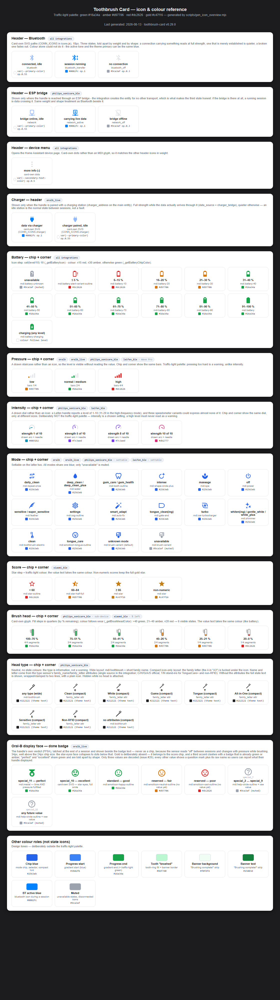

# Icon & colour reference

Every state icon the card can show, with its trigger condition, MDI name and
colour value. Battery, pressure, score and brush head share one traffic-light
palette (green `#16a34a` · amber `#d97706` · red `#dc2626` · gold `#c47f16`),
so the same tone always means the same thing. Intensity deliberately uses its
own non-alarming scale — a high intensity is a chosen setting, not a warning.
The head type stays neutral (theme text colour) for the same reason: it is
information, not a state.

Two readings are drawn rather than picked from MDI, because no icon set has
the resolution they need. Pressure is a four-bar staircase. Intensity is a
dial: a Laifen handle reports a level of 1–10, and 11–20 in the high-frequency
mode, where three speedometer variants could express almost none of it. The
needle carries the value; the ring behind it is the scale, held back enough
that the needle reads first but not so far that it disappears. Both drawn
readings look the same in the chip and in a corner marker, only at different
sizes, so where a reading is placed never changes what it looks like.

Also worth knowing: the screenshot has to be tall enough for the whole page.
Chrome captures exactly the window, so the height below grows with the
reference and a clipped last section means that number needs raising. The
quick check is whether the bottom strip of the PNG is nothing but background.
Erring high is free - a little background at the bottom costs nothing, a
missing section costs a reader the thing they came for.

All icons stay readable in the compact icon-only layout (card width ≤ 350 px,
where chip labels and values are hidden): the icon shape and colour alone
carry the state.

The done badge is the one exception to the chip grid — see
[Done badge](#done-badge) below.

## Which integration provides what

Not every reading exists on every handle, and the card hides a chip whose
reading the device does not have rather than showing a placeholder. What is
listed here is what `findDeviceEntities` actually resolves, not what an
integration documents.

| Reading | oralb | oralb_live | philips_sonicare_ble | xiaomi_ble | laifen_ble |
| :--- | :---: | :---: | :---: | :---: | :---: |
| Battery | ● | ● | ● | ● | ● |
| Pressure | ● | ● | ● | — | Wave Pro |
| Intensity | — | — | ● | — | ● |
| Mode | ● | ● | ● settable | — | ● settable |
| Score | — | — | — | ● | — |
| Brush head | — | — | ● sub-device | ● % left | — |
| Head type | — | — | ● sub-device | — | — |
| Sector | reported | reported | derived | from time | from time |
| ESP bridge icon | — | — | ● | — | — |
| Charger icon | — | ● | — | — | — |
| Display face | — | ● | — | — | — |

Two entries are worth reading twice. Xiaomi reports the percentage **left** on
the brush head where every other integration reports wear, so the card inverts
it. And a sector is only *reported* by the Oral-B integrations — Sonicare
derives it from elapsed time and the mode's visit sequence, while Xiaomi and
Laifen have none at all and the card spreads the routine over four zones by
time.



An interactive version with copyable hex values is in
[icon-overview.html](icon-overview.html).

## Done badge

The badge that holds a finished session also carries the Oral-B handle's own
display face (`FF0A`, exposed by `oralb_live` as `sensor.*_smiley`). It is not
a chip: between sessions the sensor reads `off`, and while brushing the face
follows the pressure sensor, so only the latched end-of-session value says
anything. `session-state.js` holds it as `completedFace`.

At 34 px rather than the chips' 24 px — the star-eyes face collapses into
plain dots below that.

| Value | Meaning | Icon | Colour |
| --- | --- | --- | --- |
| `special_11` | time **and** pressure fulfilled | `mdi:medal` | green `#16a34a` |
| `special_10` | star eyes, full smile | card-own SVG | green `#16a34a` |
| `standard` | the everyday face | `mdi:emoticon-happy-outline` | green `#16a34a` |
| — | *reserved* | `mdi:emoticon-neutral-outline` | amber `#d97706` |
| — | *reserved* | `mdi:emoticon-sad-outline` | red `#dc2626` |
| `special_2` … `special_9` | undecoded | `mdi:help-circle-outline` + raw value | muted `#9ca3af` |

Three deliberate choices here:

**No gold.** It belongs to the score chip, and a third accent colour clashes
with a badge that is already green (complete) or amber (aborted). `special_11`
and `special_10` therefore share green and are told apart by shape, which
carries at 34 px.

**A medal, not a podium or trophy.** `special_11` means a standard was met, not
a rank won — there is nobody to beat. A podium would also read as a bar chart
at this size, next to the progress bars directly above it.

**Undecoded values ask instead of judging.** Every MDI face has a mouth, and
every mouth is a verdict; a grey smile would claim a mildly positive result we
cannot back. So they render a question mark plus the raw sensor value, which
makes every installed card a reporter for
[#20](https://github.com/mtheli/toothbrush-card/issues/20). `standard` is
excluded from this: it is the handle's own name for its everyday face, not a
placeholder like `special_N`, and reporting the most common value would bury
the rare ones.

`special_10` and `special_11` were identified by @hipp0o in that issue.
`special_2` … `special_9` are still open.

## Regenerating

The overview is generated from `@mdi/js` and the card's own SVG paths:

```sh
node scripts/gen_icon_overview.mjs
chromium --headless --screenshot=docs/icon-overview.png \
  --window-size=1120,4000 --hide-scrollbars docs/icon-overview.html
```

The state conditions and palette in the script mirror the card logic in
`src/toothbrush-card.js` and must be kept in sync when that logic changes.
